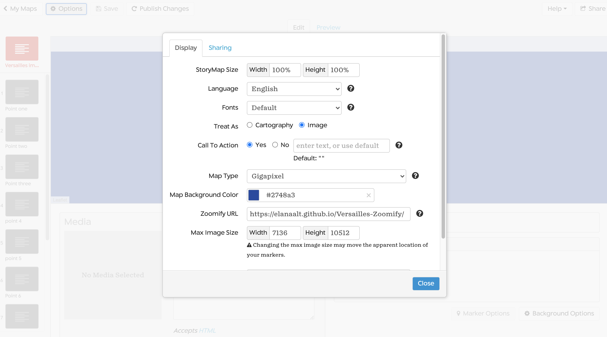

# StoryMapJS

*created by Elana Altman*

*updated October 22, 2020 by Miranda Jones-Davidis*

*updated May 4, 2023 by Eden Segbefia, Jazmin Maço*

This work is licensed under a [Creative Commons Attribution 4.0 International License](http://creativecommons.org/licenses/by/4.0/).

Introduction to the tool:
-------------------------

StoryMapJS is a free, open-source tool that combines narratives with locations, letting users tell a media-rich story. It has an easy-to-use authoring tool that's robust enough for many uses, and can also be customized with code for more advanced projects.

### The tool is great for:

-   Telling stories that have a spatial component
-   Providing an in-depth look at any 2D visual object (work of art, diagram, historical or fictional maps)
-   Quick, simple digital projects that stand on their own, or that can be included as part of a larger project

### The tool is not great for:

-   Combining quantitative data with mapping
-   Making extremely customized visuals
-   Collaborating with multiple people on one StoryMap (particularly if you're not in the same physical space)

### Materials:

-   [https://storymap.knightlab.com](https://storymap.knightlab.com/)
-   Post-It notes or pieces of paper

### Accessibility Considerations:

-   *When using StoryMapJS:*
    The StoryMapJS tool works with assistive technologies, and people with disabilities can make basic StoryMaps. However, the StoryMaps tool can be frustrating for a visually-disabled person to navigate with a screenreader.  Additionally, much of the text in the StoryMapJS tool lacks sufficient color contrast.
    When using StoryMap with an image as a map (the "gigapixel" options), a visually-disabled user may run into some problems placing locations markers on the image. If working in a group, this specific task can be assigned to another group member.

-   *When accessing published StoryMaps:* StoryMaps can be difficult to navigate for screenreader users. Because of the ways StoryMapsJS is structured, a person using a screenreader will hear a lot of nonsensical information before getting to the actual content of the StoryMap. This issue is usually worse when using an image as a map. Unfortunately, this issue is not something you can fix when making a StoryMap.
Please be aware it's always possible that there are accessibility concerns that have yet to be discovered. Additionally, remember that CARDS can always help with making assignments accessible for students with disabilities.

# Guided Practice

## Breaking Down a StorymapJS

### StoryMapJS Examples

The best way to to understand what a StoryMap is to view one. Take a look at the examples below to get a sense of what you can do with a StoryMap. As you view them, think about the following question: *What do you find compelling or effective in these StoryMaps? What doesn't work as well for you? Why?*

-   [Golden Gate to Haight: Distrusting The Government, Trusting Love](https://uploads.knightlab.com/storymapjs/520b5153c4a0fef7be4fdf56f95736fc/antiwar-protests-in-san-francisco-1960-1975/index.html)
-   [Ancient Rome in Chicago](https://s3.amazonaws.com/uploads.knightlab.com/storymapjs/783a09de8300e1b5f74b99b99acb08ef/ancient-rome-in-chicago/index.html)
-   [Hieronymus Bosch's "Garden of Earthly Delights"](https://storymap.knightlab.com/examples/bosch-garden/)
-   [A Night Out as a Columbia Student](https://www.columbiaspectator.com/spectrum/2020/04/17/a-night-out-as-a-columbia-student/)

### StoryMap Components

Each StoryMap includes a title slide, and then several location slides. The slides themselves are fairly structured, so it's useful to understand the components before building your map:

#### *For Location Slides:*

-   **Base Map:** *The same base map is used for all of your slides*. Many StoryMaps - such as this one - use one of a few geographic base maps provided by the StoryMaps too. However, you can also use an image as your base map, such as in [Hieronymus Bosch's "Garden of Earthly Delights." ](https://storymap.knightlab.com/examples/bosch-garden/)
-   **Location Marker:** This points to the specific location your slide is about.
-   **Headline:** The name of your slide. Might be the name of the location (as in the example) or the name of an event that took place at that location, though it can be anything that makes sense with your story!
-   **Description:** Additional text that helps tell your narrative.
-   **Media:** In the example above, the media is an image; it can also be a video, audio file, tweet,  Instagram post, Wikipedia excerpt, Google map or Google doc. *Please note that you can only use one piece of media for each slide.*
-   **Credit:** Space to provide credit and sourcing information for your media. This can include links as well as text.
-   **Caption (not shown above):** Short text that describes your media. While not required, it's a good idea to use a caption, as it's helpful for screenreader users, those with slower internet connections , and in cases where your media may not load (for example, if your media is a tweet that is later deleted by the Twitter user).

Except for the map and location marker, all of these components are optional. So, you can pick and choose what makes the most sense for your slide. While including all of these components can help tell a more complete, media-rich, narrative, there may be times where certain components don't make sense for the story you're telling.

#### *For Title Slides:*

The title slide can contain all of the same components as the location slides, with one crucial difference: it doesn't have a location! Instead, it will show an overview of all your locations:

The location overview will be generated automatically - you'll see that happen as you start building your map!

Planning Your StoryMap
----------------------

It is often helpful to outline your StoryMap content *before* going into the tool and actually making your map. This helps ensure you have a strong, location-based story to tell - that won't get lost in the technical weeds when you start making your map.

### Step 1

There are so many stories you could tell about yourself! You can come up with your own idea, or choose from one of the suggestions below.

-   Where you have lived
-   A common walking route
-   Significant life events
-   Locations of favorite books
-   Exploration of a personal photograph

### Step 2
Once you come up with your story, choose the kind of basemap that best reflects your story. StorymapJS allows you to choose from several kinds of basemaps including Stamen maps, Open Street maps, Custom maps, and MapBox or Gigapixel options. 
-   Stamen and Open Street maps are best for telling stories that have a spatial component. *These maps use longitudinal and latitudinal location markers.*
-   MapBox and Gigapixel options are best for people who have created their own maps or are analyzing a 2D visual object. *These maps use reference points instead of specific location markers.*  

To learn more about how to work with Gigapixel basemaps jump to: [Using A "Gigapixel" Image As Your Base Map](#using-a-gigapixel-image-as-your-base-map)

### Step 3

Write down locations and/or reference points you'd like to include on your StoryMap, using one post-it note per place (as shown below). Aim for about 5 locations.

*I did this with places in my hometown:*

*Above, I did this exercise with favorite places in my hometown.*

### Step 4

Arrange the post-it notes in the order you'd like the locations to appear in the story map. You may want to try a few different orders before deciding on one!

*Version 1, walking tour through town:*

*Version 2, day in the life:*

Reflect: *Why did you choose the order you did? Does it follow a chronological pattern, a geographic one (such as going west to east, north to south, in a circle), or something else entirely? How does your order relate to the story you're telling? Are there other orders you could have used?*

### Step 5

Take a moment to review your work - now that you have more of a narrative structure,  you may discover that you want to change a location or two to better fit with your story. You can also jot down notes about each location. What would you like to say in your description of each one? What media (photo, video, etc.) will you show for each one? It's useful to think about your content before you start making your StoryMap.

Making StoryMap Slides
----------------------

It's time to start using the StoryMap tool! This tutorial, by Tierney Steelberg at Guilford College, gives a [nice overview](https://youtu.be/X4gOXga-Q_w) of how to use the basic StoryMap features. If you're new to StoryMapJS, I'd recommend watching it before we go through the steps together.

### Step 1

To start your StoryMap, please go to [https://storymap.knightlab.com/](https://storymap.knightlab.com/). Click the big green button that says "Make a StoryMap." It will prompt you to log in with your Google account.

### Step 2

In the dialog box that pops up, give your StoryMap a name, so you can go back and find it later. Then click "create."

### Step 3

You're now in the StoryMap editor, as shown below. It's time to make your title slide.

Give your map a title, and write it in the headline box (toward the bottom right of the window). Directly below it, in the description box, write some introductory text.

Then, turn your attention to the bottom-left corner of your window. Here, you can enter the URL to your media - as mentioned, this could be an image, video, social media post. Alternatively, if it is an image, you can also upload the file from your computer (video and audio files cannot be added this way). Then, in the text boxes below it, write your credit and caption. When finished, your slide should look like this:

### Step 4

Make your location slides. To add your first location slide, click the "add slide" button on the left-hand side of your window (the button with the large plus sign). You'll be brought to a screen that looks very similar to the one for your title slide, with a key difference: there's now a box on the map for you to type in your location! As shown below, enter the address of your first location *(you can use a street address, latitude/longitude, or just a city, state or country name)*.

You'll then see a red marker on the map, showing the location you selected. Now, you can fill out the other fields - headline, description, media URL, credit and caption - just as you did for the title slide. When you're done, it should look something like this:

When you finish the first slide, continue adding slides for the rest of your locations.

### Step 5

Save and preview your work. To make sure nothing gets lost, click the "save" button  (the top-left of window) Then, click the preview tab (top-center) to see what your StoryMap looks like. You'll notice that the title slide now shows the overview of all the locations on you map.

The content of your StoryMap is now complete! But you may want to make it look different - so let's learn how to do that.

Styling Your StoryMap
----------------------
There are four main aspects of your StoryMap's visual style that you can change within the StoryMap editor:

-   Base map
-   Fonts
-   Background colors/images
-   Location markers

The *base map* and *fonts* must be the same for the entire StoryMap, while the *background color/images* and *location markers* can be different for each slide. Here's how you change each one:

**Base Map:** Open the options menu (make sure you're back in editing mode, or it won't open), and find the field for map type, towards the bottom. Choose from several of the Stamen maps, or the Open Street Maps. Reminder: The custom, MapBox or Gigapixel options are for people who have created their own maps or images. Click "close" to see your changes.

**Fonts:** Like the *base map*, you can change the *fonts* from the options menu. Select from the drop down of font options. Most of the fonts are listed in pairs: The first font listed is for the headline text, while the second is for the description test. Click "close" to see your new fonts; you may want to try a few out before deciding.

**Background Color/Images:** To change the background of your slide, click on "background options" in the bottom right corner of the window. You'll then be prompted  to select a new color for your background or upload an image. Remember, this will only change the background for this specific slide - if you want to use this background color. Also, be sure to check that your text is readable on your new background in order for the slide to be as accessible as possible! Check out [this link](https://www.w3.org/WAI/perspective-videos/contrast/) for more on how to choose colors with contrast.

**Location Markers:** To change the location markers, click "marker options," also in the bottom right corner of the window. You'll be prompted to upload an image you'd like to use for your location marker - it will only change the marker for this one slide, so you may want to change your markers for other slides as well.

Using A Gigapixel Image As Your Base Map:
----------------------

As shown above with [Hieronymus Bosch's "Garden of Earthly Delights](https://storymap.knightlab.com/examples/bosch-garden/), it is possible to use a large image (aka "gigapixel") as a base map. This allows you to tell visual and spatial stories with photographs, paintings, historical maps, diagrams, and any other type of image file you have! To see the range of possibilities, here are some more examples of StoryMaps made with images:
 
 - [Game of Thrones: Arya’s Journey](https://storymap.knightlab.com/examples/aryas-journey/)
 - [Golden Age of Versailles](https://jardins-de-louis.glitch.me/parcours.html)
 - [Southern Literary Trail](https://www.georgiahumanities.org/southern-literary-trail-story-map/)

Please note that an image file that looks like a map is still an image from a technical perspective. For example, the image in the Southern Literary Trail example is a visual representation of the United States geography. However, it's an image file type and thus is interpreted by a computer as an image. Maps have a different underlying structure than images.

### Step 1
*Select your image.* You'll need to find an image that makes sense with your content and the story you want to tell, as well as one that you have the rights to use for your project. The image's dimensions must be at least 2000px by 2000px, and it's best if they're even larger than that. Because these images are so large, you'll see them referred to on the StoryMap site as "Gigapixels."

If you don't have such an image readily available, and aren't able to find or create one, StoryMapJS may not be the best tool for your project.

### Step 2
*"Zoomify" your image.* For your image to work with StoryMapJS, the underlying technical structure of the image must resemble the underlying technical structure of a digital map. Digital maps are made up of tiles, and "zoomifying" your image is a process that converts your image into a series of tiles. You can follow [these instructions to Zoomify your image with the free Zoomify app](https://storymap.knightlab.com/gigapixel/#zoomify-export).

### Step 3
*Host the image tiles on the web.* Now that your image has been converted into tiles, the tiles must be placed on a web server. This allows StoryMapJS's servers to access your tiles. While there are several hosting services you could use for this, using GitHub is often the simplest option. You can follow [these instructions for hosting your tiles on GitHub](https://github.com/NUKnightLab/StoryMapJS/blob/master/GITHUB_HOSTING/GITHUB_HOSTING.md).

Alternatively, if you have experience with another web hosting service, feel free to use it instead.

### Step 4
*Link your StoryMap to your image tiles.* Now, you're ready to make your StoryMap using your image! To start your StoryMap, please go to https://storymap.knightlab.com and click the big green button that says "Make a StoryMap."
Once you've entered a name for your StoryMap, click the "options" button in the top-left corner. Change the "map type" to Gigapixel, as shown below:

  
In the box that says "Zoomify URL", enter the URL where your tile files are hosted. The GitHub hosting instructions will show you exactly where to find this URL. Under max image size, enter the pixel width and height of your original image (before Zoomifying it). Click close.

You're now ready to make your StoryMap, with the image as the base map! The rest of the process will be exactly the same as creating a regular StoryMap, with one small but important difference: Since you're not working with a geographical map, you cannot enter an address or longitude and latitude to place your location markers. Instead, click the image in the spot where you want to place your location markers. You can then click and drag your location marker if you'd like to move it.

Sharing Your StoryMap
---------------------

Your StoryMap is now complete! To publish and share:

1.  Save your StoryMap
2.  Click "Publish Changes" button (the button may not appear until after you save your work)
3.  Click "Share" on the top-right corner of the window. Copy the link that appears at the top, as shown:

 

4.  If you'd like to embed your StoryMap as part of a website, you can do that too - you just need to scroll down in the "share" window, and copy and paste the code that looks like this:

 

# Reflection:
- In what ways did the StoryMap tool expand how you think about places and narratives?
- In what ways were you constrained by the StoryMap tool?
- How did this tool help you think digitally about your course content?

# Resources:

## Examples of successful projects:
In addition to the examples included in the guided practice section, you can find more in the [StoryMapJS project gallery](https://storymap.knightlab.com/#examples).
-   Golden Age of Versailles (Barnard, Spring 2020):
    -   [Course Syllabus](https://courseworks2.columbia.edu/files/7880650) - available with Barnard login.
    -   [Digital Lab Outline](https://courseworks2.columbia.edu/files/7880650) - available with Barnard login.
-   [Transatlantic Slave Trade](https://www.macalester.edu/news/2016/02/slave-trade-history/) (Macalester, 2016)
- [Radio Inmigrante](https://storymap.knightlab.com/edit/?id=radio-inmigrante) (Barnard) - in progress but will be published at the end of the fall semester!

## Guides & Tutorials:
-   [StoryMapJS JSON Tutorial:](https://storymap.knightlab.com/advanced/) For those who are willing to do a little coding, this tutorial helps you customize your map a bit further
-   [StoryMapJS for Images:](https://storymap.knightlab.com/gigapixel/) How to use an image as your base map
-   [QuickStart Guide to StoryMapJS:](https://mcgrawect.princeton.edu/guides/KnightLab-StoryMaps.pdf) From Princeton's McGraw Center for Teaching & Learning
-   [Scholarly Smackdown: StoryMapJS vs. Story Maps:](https://publish.illinois.edu/commonsknowledge/2017/03/02/scholarly-smackdown-storymap-js-vs-story-maps/) Comparing two commonly used tools for telling location-based narratives

## Barnard Resources:
- Barnard faculty, staff, and students are free to reach out to the [DHC](https://digitalhumanities.barnard.edu/) or [IMATS](https://imats.barnard.edu/) for additional help!
- [FAQs from Barnard faculty and students](https://docs.google.com/document/d/1FtuoyRJs7v89dBxZCyTUwzn55SsCsso8H9sil_iMPAo/edit?usp=sharing)
